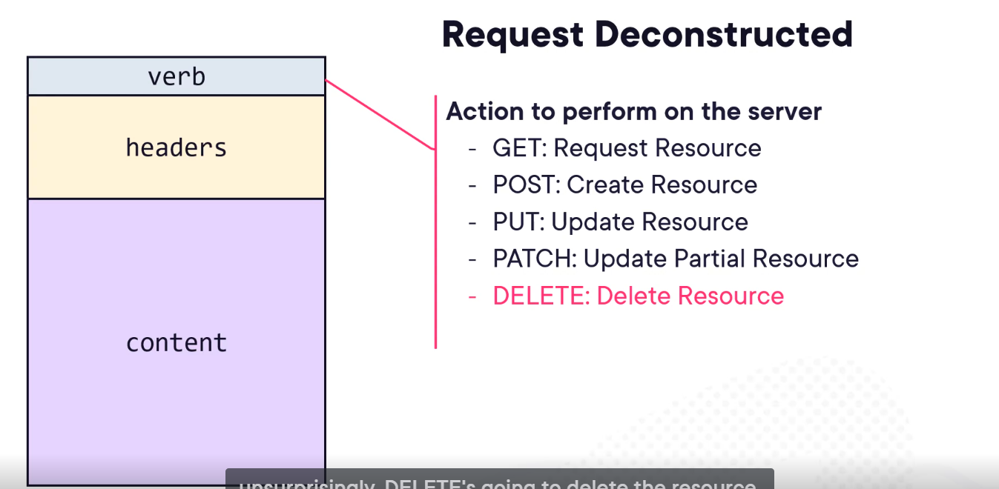
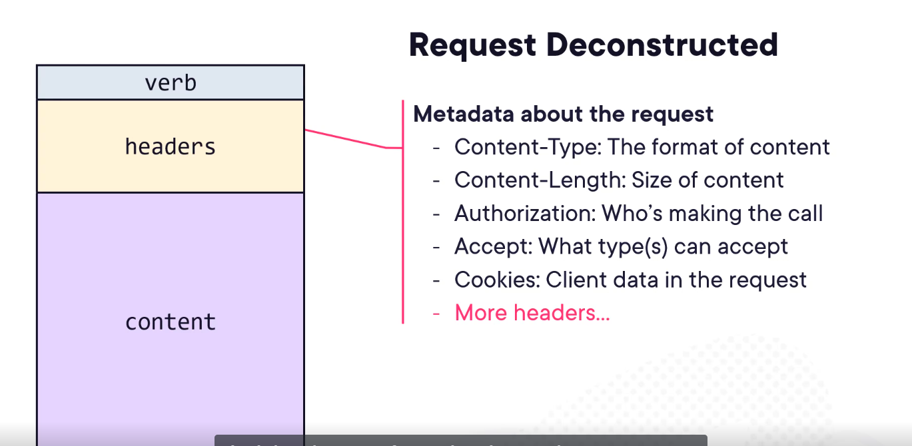
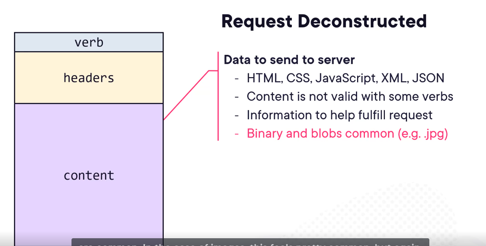
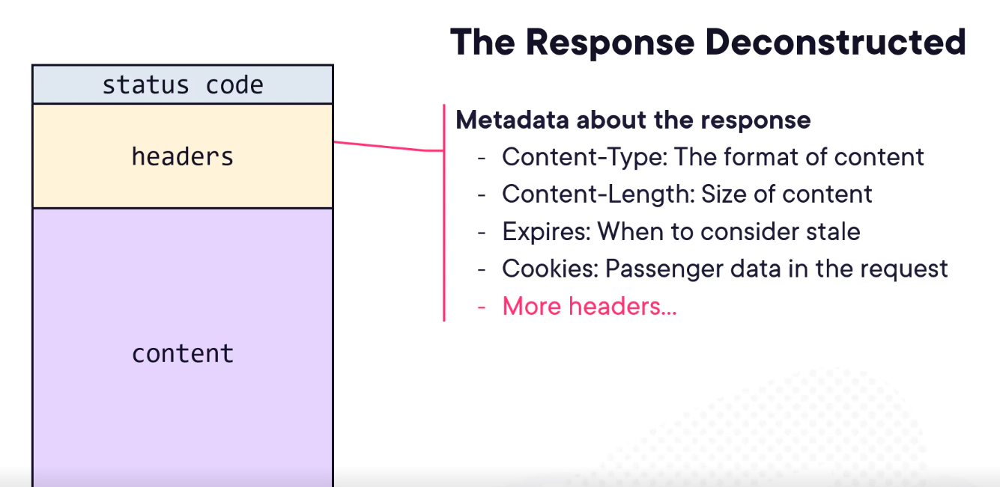
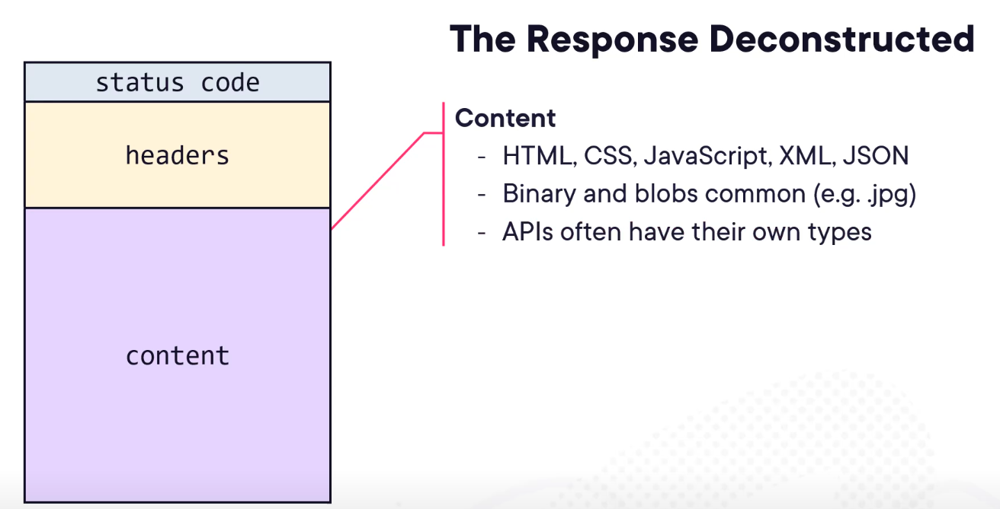

# TOOLS
1) we can check output of apis directly using VS or VS code:
    - .http/.rest extension to file, write request urls and execute
    - get rest client extension (vs code)

# Web dev basics
1) client ---> server(data center/cloud/computer that is present in your organisation)
2) request contents
    - verb - what we want to do from the request
    - header - information about the request
    - content - the actual request
3) response contents
    - status code
    - headers
    - content
4) the server here is stateless -  it means that the server does not retain any information about the client's previous requests. Each request from a client to the server is treated as an independent, isolated transaction that has no relationship to any previous requests

# REST

- Uniform Interface - A consistent way of interacting with resources, regardless of type of resource we are working with, follow a consistent, standardized pattern
- Everything is treated as a resource (like users, products, orders), and each has a unique URL.
- Cacheable requests (or cacheable responses) refer to HTTP responses that can be stored (cached) by the client, browser, or intermediary (like a CDN or proxy) and reused for future requests without contacting the server again — to save time, bandwidth, and server load.
- it works on top of http protocol
