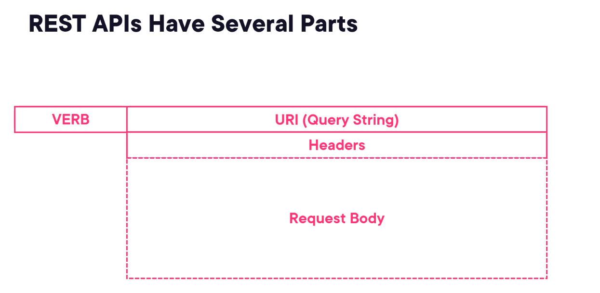
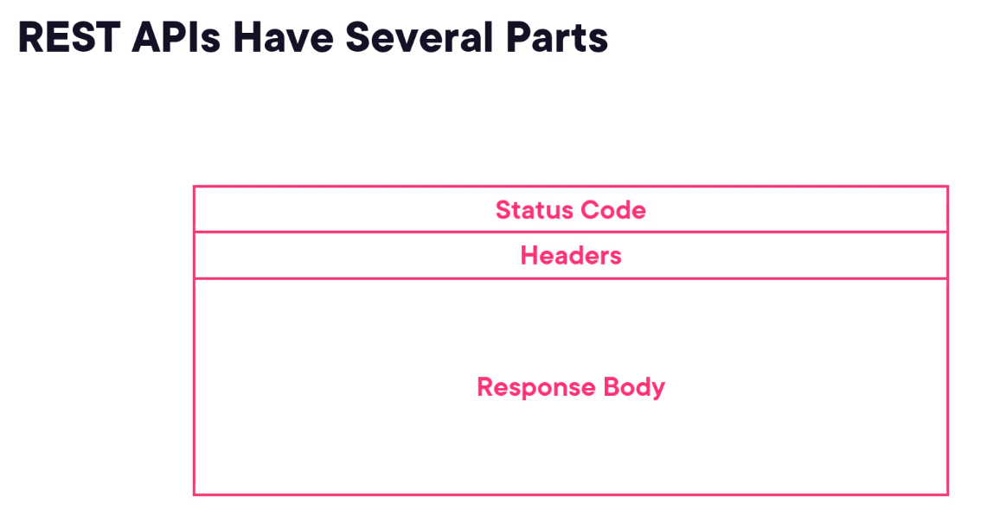
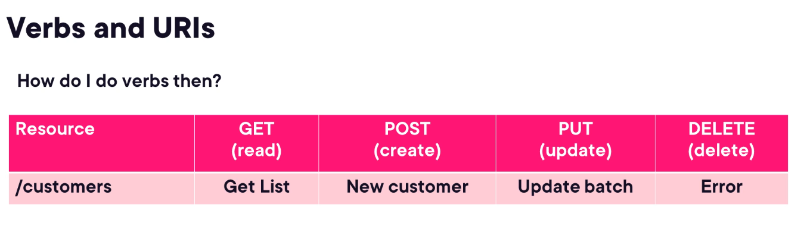
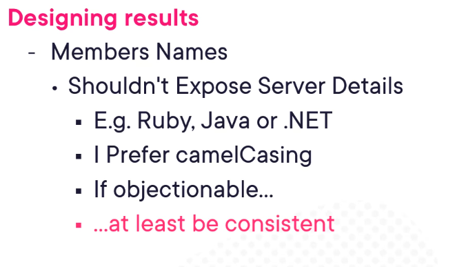
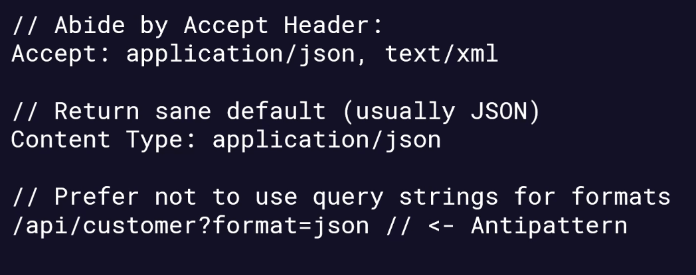
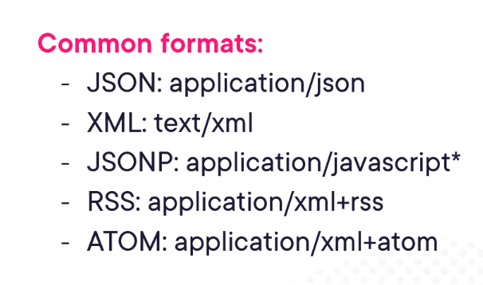

# Design your api first
- to understand the requirements
- it can last longer, can make any changes in future

# Contents of request and response

# URIs
- Uniform Resource Identifier, paths to resources(to identify resources) - it's like an address(unique)
- ex: customers/package/21
| Term    | Stands for                  | Tells You                        | Example                                              |
| ------- | --------------------------- | -------------------------------- | ---------------------------------------------------- |
| **URI** | Uniform Resource Identifier | What the resource is             | `https://example.com/product/1` or `urn:isbn:123456` |
| **URL** | Uniform Resource Locator    | Where it is and how to access it | `https://example.com/about`                          |
| **URN** | Uniform Resource Name       | The name/identity only           | `urn:uuid:1234-5678-9012`                            |

# What are these resources?
- if it is required for resource then it is need to be added as path url
- query string should be optional
- resources are objects - that are required by users(we are allowing the users to have access to this with the help of our api code)
- a resource is anything that can be named and manipulated via an API — like a user, a product, an order, etc.

# Identifiers in URIs
- to uniquely identify a resource, we can use some identifier ex: customers/1, customers/microsoft
- Query strings: can be used for non-resource properties(the attributes that don't belong to the resource) ex:customers/package/21?project=true

# Verbs and URIs
- the uri remains same, the action is taken based on verb
- 

# Idempotency
- applying operation multiple times without changing the result
- 
- delete is also not idempotent
- ex: if we execute the get verb multiple times it should return same thing unless some state change is made to it

# Designing results
- what you want to return
- a json object having an array of items/results, guiding customers to prev/next sequence of results with the help of uris
- 

# Formatting results
- generally apis support json format output
- but user may want diff type, abide by accept header
- check the accept header try to satisfy and foramt result in the same format
- 
- 